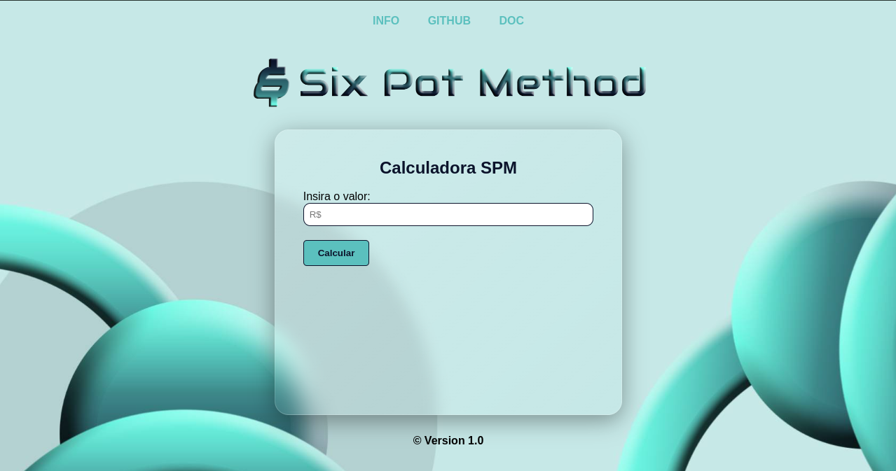
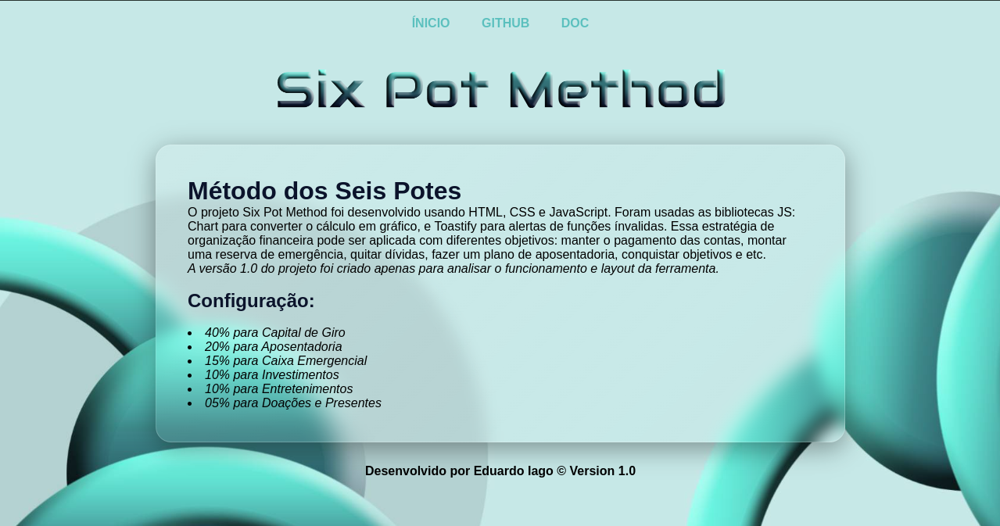
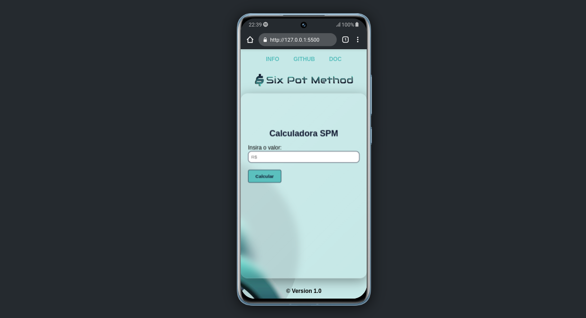
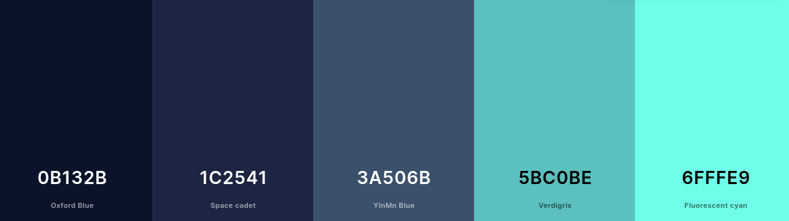

#### Calculator for Financial Organization 

The Six Pot Method project was developed using `HTML`, `CSS` and `JavaScript`. The **Chart** libraries were used to convert the calculation into a graph, and **Toastify** to warn of invalid functions. This financial organization strategy can be applied with different objectives: keeping bills paid, setting up an emergency reserve, paying off debts, making a retirement plan, achieving goals, etc.

The project is quite old, I had done it in excel before because I used it a lot. I thought I'd develop it because I hadn't seen any online tool that uses the six pot method to calculate recipes. The project is still under development. If you have any ideas for improving the tool, please contribute or get in touch to help finalize it.

_Version 1.0 of the project was created just to analyze the functioning and layout of the tool._ 

### Pending Updates

- [ ] Visual identity planning.
- [ ] Conversion of the site to other currencies.
- [ ] Improve visualization of the graph.
- [ ] Option for the user to choose the value of the percentages.
- [ ] Configure Media Query for all devices.

#

> ## Online Project

To see the project online just click on [HERE](https://sixpotmethod.netlify.app) or enter the link [sixpotmethod.netlify.app](https://sixpotmethod.netlify.app).

---

## Functionalities

- **Organizing financial income**: Using the six pots method, you can separate income for various topics and vary the percentage according to the topics.
- **Optimization for calculating percentages**: The option to change percentages will be implemented in the tool. The user will then be able to modify them according to their plan.  

## Configuration

| Percentages   | Description        |
|---------------|--------------------|
|  40%          | Working Capital    |
|  20%          | Retirement         |
|  15%          | Emergency Box      |
|  10%          | Investments        |
|  10%          | Entertainment      |
|  5%           | Donations and Gifts|

_The best-known structure of the six pot method is divided as follows: 55%, 10%, 10%, 10%, 10%, 5%. However, this way works better for me. An option will be added for the user to choose the percentages they want to calculate using the method._ 

## Layout



#### Info Page



#### Mobile



## Color palette:



``` css
:root
{
    --color-primary-1: #6fffe9;
    --color-primary-2: #5bc0be;
    --color-primary-3: #3a506b;
    --color-primary-4: #1c2541;
    --color-primary-5: #0b132b;
}
```

## License
 * [GNU General Public License v3.0](LICENSE)

## Technologies used:

&nbsp;&nbsp;&nbsp;

##### JS libraries

`Chart` was used to convert the calculation into a graph.

`Toastify` was used in js to generate alerts for invalid commands.
